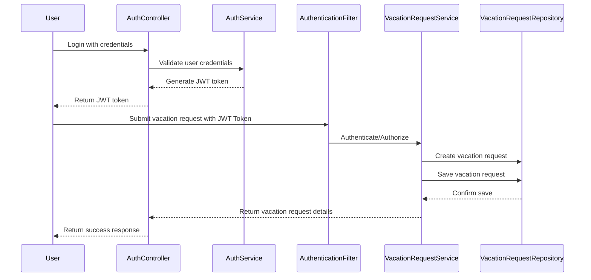

# Vacation Management Service

A REST API service for managing employee vacation requests with role-based access control.

##  Remote Host
- The application is deployed in the google cloud - click on following link to view the running application

- Swagger Documentation https://vacationservice-300594231469.us-west1.run.app/swagger-ui/index.html
<br>

## Demo of Usage of API Endpoints
- I have created demo to demonstrate the endpoints click on following link to view the demo
- Click on the link to view the [Demo](https://drive.google.com/file/d/1vEAyLxE1eDSjaNPxJ_TDQXE4UvoI-ZIT/view?usp=drive_link)
<br/>
### Postman collection
- Download the postman collection to run the requests 
[PostmanCollection](https://drive.google.com/file/d/1vEAyLxE1eDSjaNPxJ_TDQXE4UvoI-ZIT/view?usp=drive_link)

## API Documentation
The API documentation is available through Swagger UI at:
- https://vacationservice-300594231469.us-west1.run.app/swagger-ui/index.html

## Open API Spec
- https://vacationservice-300594231469.us-west1.run.app/v3/api-docs

## Class Diagram

[Click this link](https://drive.google.com/file/d/1mgkB4622TUEffe-OGrCpxFU_1ybASUzP/view?usp=drive_link)

## Sequence Diagram
[Click this link](https://drive.google.com/file/d/1YgAKEvKKfThavwuwS2H3dJq0iP2Js09_/view?usp=drive_link)


## Authentication
The application uses JWT (JSON Web Token) based authentication. To access protected endpoints:

1. Register a new user or use existing credentials
2. Login to obtain a JWT token
3. Include the token in the Authorization header for subsequent requests:
   ```
   Authorization: Bearer <your_jwt_token>
   ```

### Default Users
The application comes with pre-configured users:
- Employee accounts:
    - Username: `john` / Password: `password123`
    - Username: `alice` / Password: `password123`
- Manager account:
    - Username: `bob` / Password: `password123`

## Features

### Employee Features
Employees can:
- View their remaining vacation days (30 days/year limit)
- Submit vacation requests
- View their own vacation request history
- Cancel their pending requests

API endpoints available at `/worker/**`

### Manager Features
Managers can:
- View all vacation requests with filtering options (pending/approved)
- View individual employee overviews
- Check for overlapping vacation requests
- Process (approve/reject) vacation requests
- Generate reports on vacation usage

API endpoints available at `/requests/**`

## Authentication Endpoints

### 1. Register User
```http
POST /auth/register
Content-Type: application/json

{
    "username": "newuser",
    "password": "password123",
    "role": "EMPLOYEE"  // or "MANAGER"
}
```

### 2. Login
```http
POST /auth/login
Content-Type: application/json

{
    "username": "username",
    "password": "password"
}
```

Response includes JWT token:
```json
{
  "accessToken": "eyJhbG...",
  "tokenType": "Bearer"
}
```

## Technical Details
- Built with Spring Boot
- Uses H2 in-memory database
- JWT-based authentication
- OpenAPI documentation
- Test coverage included

## Running Locally

### Prerequisites
- Java 17 or higher
- Maven

### Steps
1. Clone the repository
2. Navigate to the project directory
3. Run the application:
   ```bash
   ./mvnw spring-boot:run
   ```
4. Access the application at `http://localhost:8080`
5. Access Swagger UI at `http://localhost:8080/swagger-ui/index.html`

## Security Notes
- JWT tokens expire after 24 hours
- All endpoints except `/auth/**` require authentication
- Role-based access control is enforced for all protected endpoints
